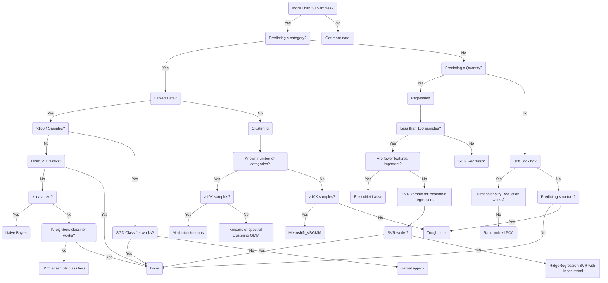

Start --> More_Than_50_Samples

    Not_Predicting_a_Category --> Predicting_a_quantity
      Predicting_a_quantity --> Regression
        Regression --> Less_than_100_samples
          Less_than_100_samples --> Fewer_features_important
            Fewer_features_important --> ElasticNet_Lasso
          Less_than_100_samples --> Fewer_features_not_important
            Fewer_features_not_important --> SVR_with_rbf_kernal_EnsembleRegressors
              SVR_with_rbf_kernal_EnsembleRegressors --> SVR_works
              SVR_with_rbf_kernal_EnsembleRegressors --> SVR_doesnt_work
                SVR_doesnt_work --> RidgeRegression_SVR_with_linear_kernal
        Regression --> 100_samples_or_more
          100_samples_or_more --> SGD_Regressor
    Not_Predicting_a_Category --> Not_Predicting_a_quantity
      Not_Predicting_a_quantity --> Just_looking
        Just_looking --> Dimensionality_reduction_works
        Just_looking --> Dimensionality_reduction_doesnt_work
          Dimensionality_reduction_doesnt_work --> Randomized_PCA
      Not_Predicting_a_quantity --> Not_just_looking
        Not_just_looking --> Predicting_structure
          Predicting_structure --> Tough_luck
        Not_just_looking --> Not_predicting_structure

```

id1(This is the text in the box)
A-->|text|B
