```mermaid
flowchart TD
Start --> More_Than_50_Samples
  More_Than_50_Samples --> Predicting_a_Category
    Predicting_a_Category --> Labeled_Data
      Labled_Data --> Classification_less_than_100K_samples
        Classification_less_than_100K_samples --> Linear_SVC_works
        Classification_less_than_100K_samples --> Linear_SVC_doesnt_work
          Linear_SVC_doesnt_work --> Text
            Text --> Naive_bayes
          Linear_SVC_doesnt_work --> Not_text
            Not_text --> Kneighbors_classifier_works
            Not_text --> Kneighbors_classifier_doesnt_work
              Kneighbors_classifier_doesnt_work --> SVC_ensemble_classifiers
      Labled_Data --> Classification_more_than_100K_samples
        Classification_more_than_100K_samples --> SGD_classifier_works
        Classification_more_than_100K_samples --> SGD_classifier_doesnt_work
          SGD_classifier_doesnt_work --> kernal_approx
    Predicting_a_Category --> Non-labeled_Data
      Non-labeled_Data --> Clustering_with_known_number_of_categories
        Clustering_with_known_number_of_categories --> less_than_10K_samples
          less_than_10K_samples --> Kmeans_or_spectral_clustering_GMM
        Clustering_with_known_number_of_categories --> more_than_10K_samples
          more_than_10K_samples --> minbatch_Kmeans
      Non-labeled_Data --> Clustering_with_unknown_number_of_categories
        Clustering_with_unknown_number_of_categories --> less_than_10K_samples
          less_than_10K_samples --> Meanshift_VBGMM
        Clustering_with_unknown_number_of_categories --> more_than_10K_samples
          more_than_10K_samples --> tough_luck
  More_Than_50_Samples --> Not_Predicting_a_Category
    Not_Predicting_a_Category --> Predicting_a_quantity
      Predicting_a_quantity --> Regression
        Regression --> Less_than_100_samples
          Less_than_100_samples --> Fewer_features_important
            Fewer_features_important --> ElasticNet_Lasso
          Less_than_100_samples --> Fewer_features_not_important
            Fewer_features_not_important --> SVR_with_rbf_kernal_EnsembleRegressors
              SVR_with_rbf_kernal_EnsembleRegressors --> SVR_works
              SVR_with_rbf_kernal_EnsembleRegressors --> SVR_doesnt_work
                SVR_doesnt_work --> RidgeRegression_SVR_with_linear_kernal
        Regression --> 100_samples_or_more
          100_samples_or_more --> SGD_Regressor
    Not_Predicting_a_Category --> Not_Predicting_a_quantity
      Not_Predicting_a_quantity --> Just_looking
        Just_looking --> Dimensionality_reduction_works
        Just_looking --> Dimensionality_reduction_doesnt_work
          Dimensionality_reduction_doesnt_work --> Randomized_PCA
      Not_Predicting_a_quantity --> Not_just_looking
        Not_just_looking --> Predicting_structure
          Predicting_structure --> Tough_luck
        Not_just_looking --> Not_predicting_structure
Start --> Less_Than_50_Samples
  Less_Than_50_Samples --> Get_More_Data

```

Start
>50 samples?
  no get more data
  yes predicting a category?
    no predicting a quantity?
      yes (then we'll do regression) < 100 samples?
        yes fewer features important?
          yes - ElasticNet Lasso
          No - SVR(kernel = 'rbf') EnsembleRegressors if not working, RidgeRegression SVR(kernal='linear')
        No - SGD Regressor
      No - just looking?
        yes - (then we'll do dimensionality reduction) randomized PCA if not working, if less than 10K samples Isomap Spectal Embedding or LLE, otherwise Kernal Approx.
        No - Predicing structure? tough luck
    yes labeled data?
      yes (then we'll do classification) <100K samples?
        yes Linear SVC if not working is text? if yes, naive bayes, if not text then Kneighbors classifier or if not working SVC ensemble classifiers
        No SGD classifier and if not working kernal approx.
      no (then we'll do clustering) Are number of categories known for sure?
        No - <10K samples 
          yes - Meanshift VBGMM
          no - otherwise tough luck
        Yes - <10K samples?
          yes Kmeans or spectral clustering GMM
          no  minbatch Kmeans
  
