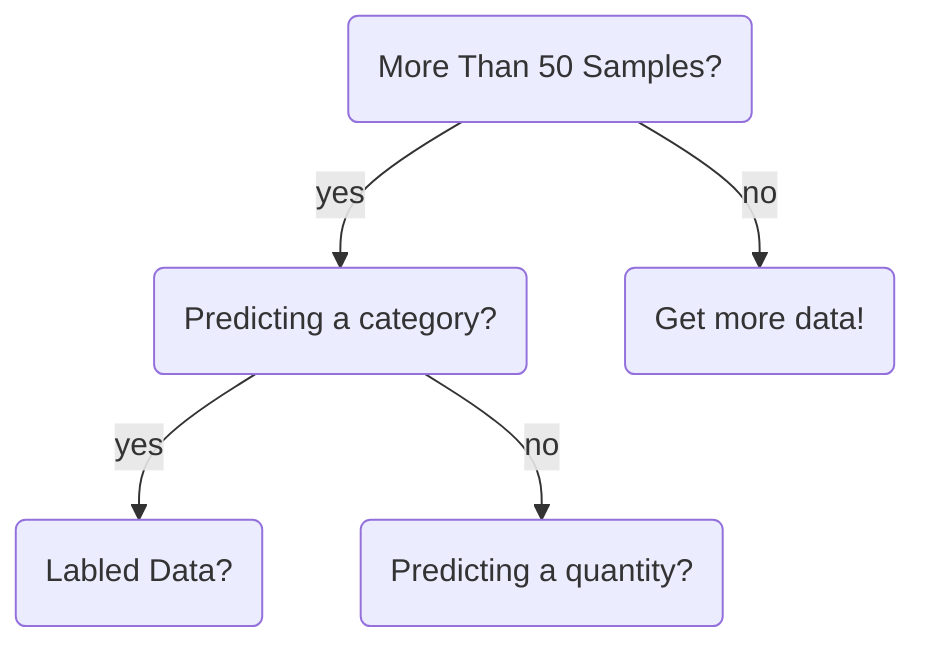

Start --> More_Than_50_Samples
  More_Than_50_Samples --> Predicting_a_Category
    Predicting_a_Category --> Labeled_Data
      Labeled_Data --> Classification_less_than_100K_samples
        Classification_less_than_100K_samples --> Linear_SVC_works
        Classification_less_than_100K_samples --> Linear_SVC_doesnt_work
          Linear_SVC_doesnt_work --> Text
            Text --> Naive_bayes
          Linear_SVC_doesnt_work --> Not_text
            Not_text --> Kneighbors_classifier_works
            Not_text --> Kneighbors_classifier_doesnt_work
              Kneighbors_classifier_doesnt_work --> SVC_ensemble_classifiers
      Labeled_Data --> Classification_more_than_100K_samples
        Classification_more_than_100K_samples --> SGD_classifier_works
        Classification_more_than_100K_samples --> SGD_classifier_doesnt_work
          SGD_classifier_doesnt_work --> kernal_approx
    Predicting_a_Category --> Non-labeled_Data
      Non-labeled_Data --> Clustering_with_known_number_of_categories
        Clustering_with_known_number_of_categories --> less_than_10K_samples
          less_than_10K_samples --> Kmeans_or_spectral_clustering_GMM
        Clustering_with_known_number_of_categories --> more_than_10K_samples
          more_than_10K_samples --> minbatch_Kmeans
      Non-labeled_Data --> Clustering_with_unknown_number_of_categories
        Clustering_with_unknown_number_of_categories --> less_than_10K_samples
          less_than_10K_samples --> Meanshift_VBGMM
        Clustering_with_unknown_number_of_categories --> more_than_10K_samples
          more_than_10K_samples --> tough_luck
  More_Than_50_Samples --> Not_Predicting_a_Category
    Not_Predicting_a_Category --> Predicting_a_quantity
      Predicting_a_quantity --> Regression
        Regression --> Less_than_100_samples
          Less_than_100_samples --> Fewer_features_important
            Fewer_features_important --> ElasticNet_Lasso
          Less_than_100_samples --> Fewer_features_not_important
            Fewer_features_not_important --> SVR_with_rbf_kernal_EnsembleRegressors
              SVR_with_rbf_kernal_EnsembleRegressors --> SVR_works
              SVR_with_rbf_kernal_EnsembleRegressors --> SVR_doesnt_work
                SVR_doesnt_work --> RidgeRegression_SVR_with_linear_kernal
        Regression --> 100_samples_or_more
          100_samples_or_more --> SGD_Regressor
    Not_Predicting_a_Category --> Not_Predicting_a_quantity
      Not_Predicting_a_quantity --> Just_looking
        Just_looking --> Dimensionality_reduction_works
        Just_looking --> Dimensionality_reduction_doesnt_work
          Dimensionality_reduction_doesnt_work --> Randomized_PCA
      Not_Predicting_a_quantity --> Not_just_looking
        Not_just_looking --> Predicting_structure
          Predicting_structure --> Tough_luck
        Not_just_looking --> Not_predicting_structure
Start --> Less_Than_50_Samples
  Less_Than_50_Samples --> Get_More_Data
```

id1(This is the text in the box)
A-->|text|B
